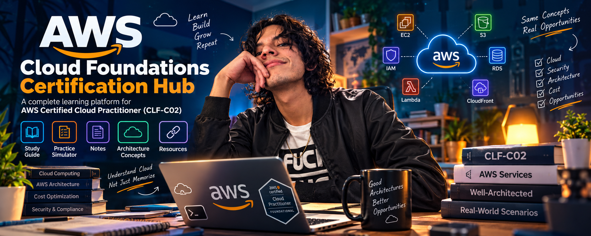
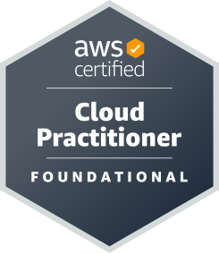
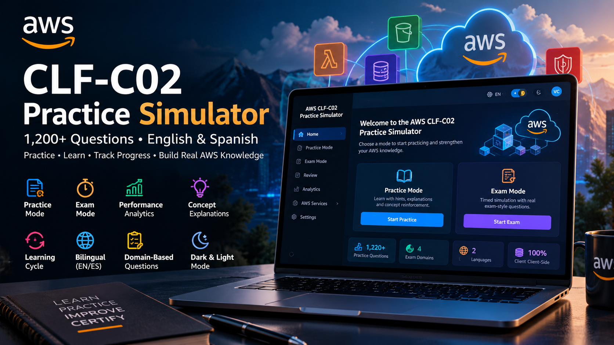
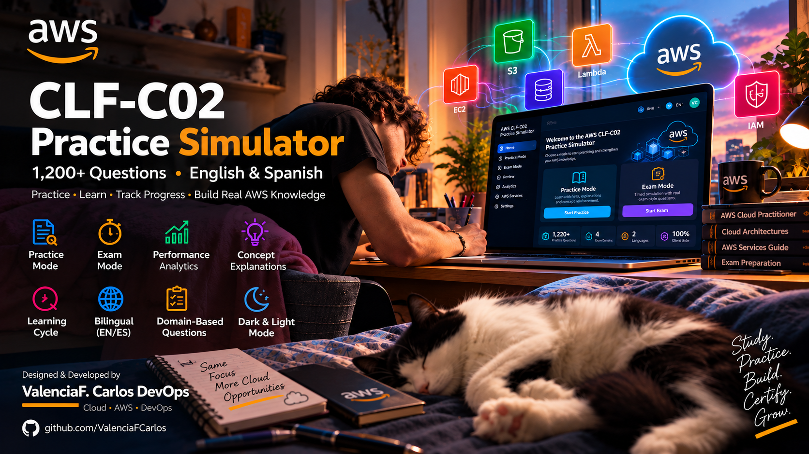
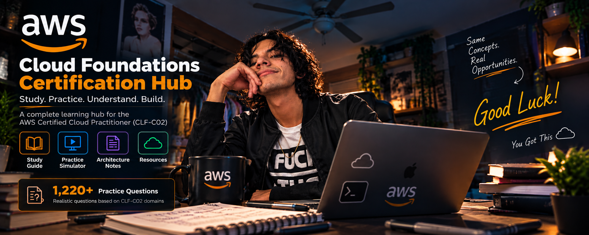

# 🚀 AWS Cloud Foundations & Certification Hub

<p align="center">
  
</p>

<p align="center">


</p>

> 🎯 **A complete learning hub for AWS Cloud Foundations and AWS Certified Cloud Practitioner (CLF-C02).**
>
> Study guides, architecture notes, certification preparation resources, and hands-on learning materials designed to help you understand cloud computing—not just memorize AWS services.

<p align="center">
  
</p>

---

# 🚀 Practice Simulator Preview

<p align="center">
  
</p>

> A completely free interactive simulator designed to reinforce AWS Cloud Practitioner concepts through practice, repetition, and concept-based learning.

---

## 📋 Table of Contents

- [☁️ About This Project](#️-about-this-project)
- [🚀 Interactive Practice Simulator](#-interactive-practice-simulator)
- [📚 What's Included](#-whats-included)
- [📊 AWS Certified Cloud Practitioner (CLF-C02)](#-aws-certified-cloud-practitioner-clf-c02)
- [📖 Study Guide](#-study-guide)
- [🏗️ Repository Structure](#️-repository-structure)
- [📚 Recommended AWS Resources](#-recommended-aws-resources)
- [🤝 Contributing](#-contributing)
- [⚠️ Disclaimer](#️-disclaimer)
- [⭐ Support the Project](#-support-the-project)
- [👨‍💻 Author](#-author)

---

# ☁️ About This Project

AWS Cloud Foundations & Certification Hub is a learning repository designed to help students, IT professionals, career changers, and cloud enthusiasts build a strong foundation in AWS Cloud.

The objective is not simply to pass a certification exam.

The objective is to understand:

- Cloud Computing fundamentals
- AWS architecture principles
- Core AWS services
- Security and compliance concepts
- Cost optimization strategies
- Cloud economics
- Real-world cloud use cases
- Cloud architecture thinking
- Certification preparation

This repository combines structured learning material, architecture notes, study guides, and certification preparation resources.

---

# 🚀 Interactive Practice Simulator

As part of this AWS learning journey, I designed and developed a complete interactive simulator for the AWS Certified Cloud Practitioner (CLF-C02) exam.

The simulator contains:

- 1,220+ original practice questions
- English 🇺🇸 & Spanish 🇲🇽 support
- Practice Mode & Exam Mode
- AWS Level & Exam Readiness metrics
- Learning Cycle concept reinforcement
- Domain-based analytics
- Light & Dark themes
- Local progress persistence

### 🆓 Completely Free

This simulator is provided free of charge to help students, career changers, and cloud enthusiasts learn AWS Cloud concepts and prepare for the AWS Certified Cloud Practitioner (CLF-C02) exam.

No subscriptions.

No paywalls.

No ads.

Just learning.

### 👈 Start Here, Launch Now! 👉

<p align="center">
  <a href="https://valenciafcarlos.github.io/AWS-CLF-C02-Practice-Simulator-by-ValenciaFCarlosDevOps/">
    
  </a>
</p>

<p align="center">
  <strong>Practice with 1,220+ AWS CLF-C02 Questions</strong><br>
  English 🇺🇸 • Español 🇲🇽 • Exam Mode • Learning Cycle
</p>

### 🌐 Live Demo

https://valenciafcarlos.github.io/AWS-CLF-C02-Practice-Simulator-by-ValenciaFCarlosDevOps/

### 💻 Source Code

https://github.com/ValenciaFCarlos/AWS-CLF-C02-Practice-Simulator-by-ValenciaFCarlosDevOps

---

# 📸 Simulator Screenshot

<p align="center">
  
</p>

---

# 📚 What's Included

| Resource | Description |
|-----------|-------------|
| 🚀 Practice Simulator | Interactive CLF-C02 simulator with 1,220+ bilingual questions |
| 📖 Study Guide | Structured learning path aligned with official exam domains |
| 📝 Notes | Personal notes, summaries, and mental models |
| 🔗 Resources | Curated AWS learning resources |
| ☁️ Cloud Architecture Concepts | Foundational architecture knowledge |
| 🎓 Certification Preparation | AWS certification study material |

---

# 📊 AWS Certified Cloud Practitioner (CLF-C02)

## Official AWS Resources

🔗 Certification Page

https://aws.amazon.com/certification/certified-cloud-practitioner/

📄 Official Exam Guide (PDF)

https://d1.awsstatic.com/training-and-certification/docs-cloud-practitioner/AWS-Certified-Cloud-Practitioner_Exam-Guide.pdf

---

## 🎓 Exam Overview

| Aspect | Details |
|----------|----------|
| Duration | 90 Minutes |
| Questions | 65 |
| Format | Multiple Choice & Multiple Response |
| Passing Score | 700 / 1000 |
| Cost | $100 USD |
| Validity | 3 Years |
| Prerequisites | None |

---

## 🎯 Official Exam Domain Weights

| Domain | Weight |
|----------|----------|
| Cloud Concepts | 24% |
| Security and Compliance | 30% |
| Cloud Technology and Services | 34% |
| Billing, Pricing, and Support | 12% |

---

# 📖 Study Guide

The study guide covers all official CLF-C02 domains.

## 🌩️ Cloud Concepts

- What is Cloud Computing
- Benefits of Cloud Computing
- Elasticity vs Scalability
- Cloud Deployment Models
- Cloud Service Models
- AWS Global Infrastructure

## 🔒 Security & Compliance

- Shared Responsibility Model
- AWS Identity and Access Management (IAM)
- Multi-Factor Authentication (MFA)
- Security Services
- Compliance Programs
- Security Best Practices

## ⚙️ Cloud Technology & Services

- Amazon EC2
- AWS Lambda
- Amazon S3
- Amazon EBS
- Amazon EFS
- Amazon RDS
- Amazon DynamoDB
- Amazon VPC
- Amazon CloudFront
- Amazon Route 53
- Elastic Load Balancing

## 💰 Billing, Pricing & Support

- AWS Pricing Models
- AWS Cost Explorer
- AWS Budgets
- Reserved Instances
- Savings Plans
- AWS Support Plans
- AWS Organizations

---

# 🏗️ Repository Structure

```text
AWS-Cloud-Foundations-Certification-Hub
│
├── images/
│   ├── banner-main.png
│   ├── aws-certified-cloud-practitioner.svg
│   ├── practice.png.png
│   ├── clf-c02-simulator-preview.png
│   └── good-luck.png
│
├── guide/
├── notes/
├── resources/
└── README.md
```

📚 Recommended AWS Resources
AWS Skill Builder

https://skillbuilder.aws

AWS Cloud Practitioner Essentials

https://skillbuilder.aws/learn

AWS Documentation

https://docs.aws.amazon.com

AWS Well-Architected Framework

https://aws.amazon.com/architecture/well-architected/

🤝 Contributing

Contributions are welcome.

Ways to contribute:

Report bugs
Suggest improvements
Submit pull requests
Improve documentation
Share study resources
Report ambiguous questions
⚠️ Disclaimer

This project is an independent educational resource.

It is not affiliated with, endorsed by, sponsored by, or maintained by Amazon Web Services (AWS).

AWS®, Amazon Web Services®, Cloud Practitioner®, and all related trademarks belong to Amazon.com, Inc. and its affiliates.

Question content, notes, guides, and learning materials are provided for educational purposes only.

⭐ Support the Project

If this repository helps you in your AWS learning journey, consider giving it a ⭐.

It helps more people discover free AWS learning resources.

👨‍💻 Author
ValenciaF. Carlos DevOps

AWS Certified Cloud Practitioner
Cloud Architecture Student
DevOps Engineer

🔗 GitHub
https://github.com/ValenciaFCarlos

🔗 LinkedIn
https://www.linkedin.com/in/valencia-carlos-77a1b213b/

☁️ Feel free to connect, collaborate, or contribute to this project.

🎯 Good Luck
<p align="center">  </p>

☁️ Cloud is not about memorizing services.

It is about understanding systems, architecture, trade-offs, and solving real business problems.

Last Updated: September 2026
Certification Version: AWS Certified Cloud Practitioner (CLF-C02)
