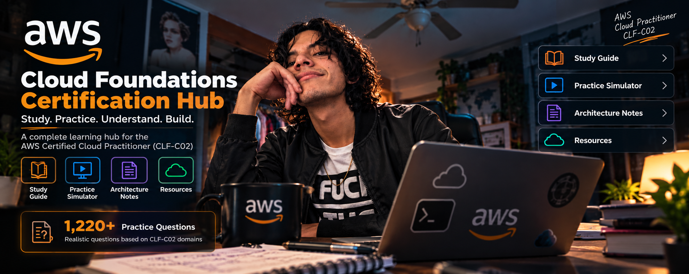
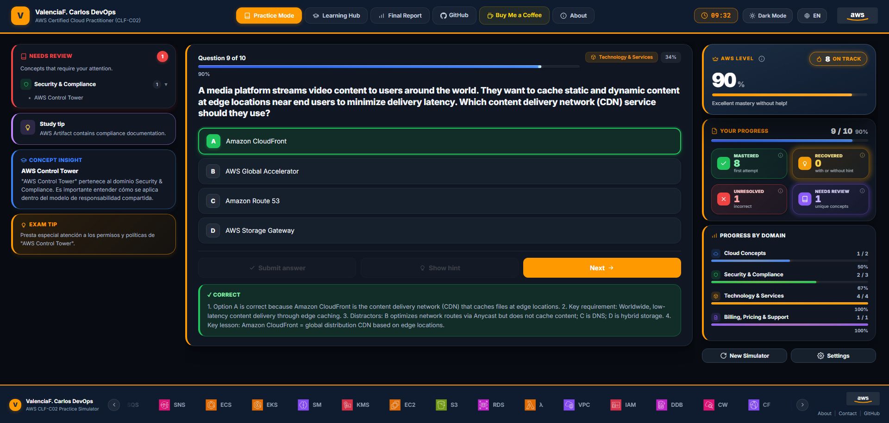
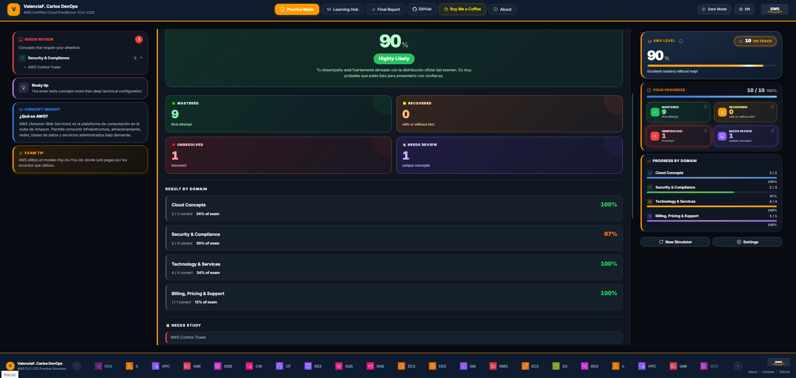
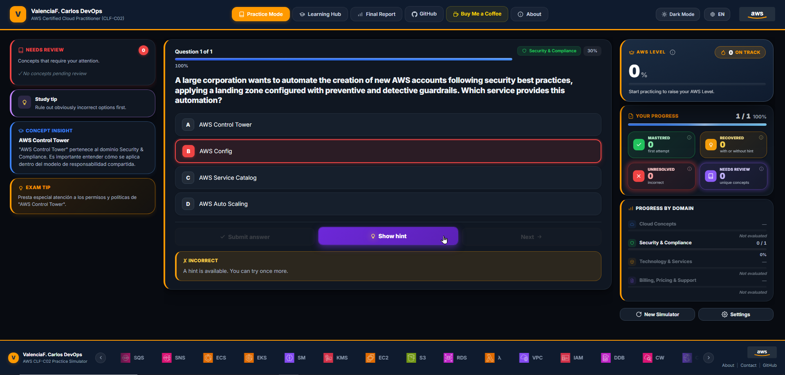

# 🚀 AWS CLF-C02 Practice Simulator

<p align="center">
  
</p>

<p align="center">
  <strong>Interactive practice simulator for the AWS Certified Cloud Practitioner (CLF-C02) certification.</strong>
</p>

<p align="center">
  Built to help learners understand AWS concepts, identify weak areas, and develop real cloud knowledge—not just memorize answers.
</p>

---

## 📌 Overview

AWS CLF-C02 Practice Simulator is an interactive learning platform designed to help students prepare for the AWS Certified Cloud Practitioner (CLF-C02) certification exam.

The simulator contains **1,220+ original practice questions** available in both **English and Spanish**, organized according to the official CLF-C02 exam domains and weighted using AWS exam distribution percentages.

Unlike traditional quiz applications, this simulator focuses on concept reinforcement through progressive hints, concept explanations, learning cycles, and detailed performance analytics.

The objective is simple:

> Learn AWS concepts deeply enough to understand why an answer is correct—not just remember which option to click.

---

## ⚠️ Important Disclaimer

This is an independent educational project.

It is **NOT** affiliated with, endorsed by, sponsored by, or maintained by Amazon Web Services (AWS).

- This simulator is not an official AWS exam.
- Questions are original educational content.
- No exam dumps or leaked questions are included.
- Internal metrics are estimates and are not official AWS scores.
- AWS has not reviewed or validated the question bank.

If you find an ambiguous or incorrect question, please open an issue.

---

# ✨ Features

### 🎯 Question Bank

- 1,220+ practice questions
- English and Spanish support
- Original educational content
- Concept-based organization
- Domain-weighted sampling

### 🧪 Practice Modes

#### Practice Mode

- No timer
- Progressive hints
- Concept explanations
- Learning-oriented experience

#### Exam Mode

- Timed simulation
- Real exam-style experience
- Domain weighting identical to CLF-C02
- Performance report at completion

### 🧠 Learning Features

- Progressive Hint System
- Concept Insight
- Learning Cycle
- Retry Sessions
- Needs Review Tracking
- Domain Performance Analysis

### 📊 Analytics

- AWS Level
- Exam Readiness
- Success Estimate
- Mastered Concepts
- Recovered Concepts
- Unresolved Concepts
- Weak Domain Identification

### 🎨 User Experience

- Dark Mode
- Light Mode
- Fully Responsive
- Local Progress Persistence
- Zero Dependencies
- Fully Client-Side

---

# 📸 Simulator Preview

## Session Setup

<p align="center">
  
</p>

Configure your session, select a domain, choose Practice or Exam Mode, and define the number of questions.

---

## Interactive Question Experience

<p align="center">
  
</p>

Answer questions, request hints, review concept explanations, and strengthen your understanding of AWS services and cloud concepts.

---

## Final Performance Report

<p align="center">
  
</p>

Receive detailed analytics covering mastery levels, domain performance, and overall exam preparedness.

---

## Learning Cycle

<p align="center">
  
</p>

Failed concepts trigger additional questions from the same topic area to validate actual understanding before marking a concept as mastered.

---

# 🏗️ How the Simulator Works

The simulator follows the official AWS CLF-C02 domain weighting.

| Domain | Weight |
|----------|----------|
| Cloud Concepts | 24% |
| Security & Compliance | 30% |
| Cloud Technology & Services | 34% |
| Billing, Pricing & Support | 12% |

When Mixed Exam mode is selected, questions are distributed according to these percentages.

Example:

For a 100-question session:

- Cloud Concepts → 24 questions
- Security & Compliance → 30 questions
- Technology & Services → 34 questions
- Billing & Support → 12 questions

This creates a more realistic exam experience than simple random selection.

---

# 🧠 Learning Cycle

One of the most important features of the simulator.

Most practice platforms repeat the exact same failed question.

This simulator takes a different approach.

```text
Incorrect Answer
        ↓
Hint
        ↓
Concept Insight
        ↓
Learning Cycle
        ↓
New Question
From Same Concept
        ↓
Concept Validation
```

Example:

You fail a question about Amazon S3 storage classes.

Instead of showing the same question again, the simulator generates another question about the same underlying concept.

This encourages:

- Concept understanding
- Knowledge transfer
- Long-term retention
- Reduced memorization

---

# 📊 Understanding the Metrics

The simulator includes several proprietary learning metrics designed to help learners measure progress.

These metrics are educational indicators and should not be interpreted as official AWS scoring systems.

---

## 🏆 AWS Level

AWS Level measures immediate mastery.

It focuses on:

- Correct answers
- First attempt success
- No hint usage

Formula:

```text
Correct on First Attempt
Without Hints
        ÷
Total Questions
```

A high AWS Level indicates strong conceptual understanding.

---

## 🎯 Exam Readiness

Exam Readiness estimates how prepared you are for a full CLF-C02 exam experience.

Unlike AWS Level, it considers:

- Mastered concepts
- Recovered concepts
- Domain performance
- Learning progress

Formula includes:

```text
Mastered Concepts
+
Recovered Concepts
+
Domain Balance
```

This metric represents preparation, not prediction.

---

## 📈 Success Estimate

Success Estimate evaluates how closely your performance aligns with the official CLF-C02 domain distribution.

The simulator compares:

```text
Expected Domain Performance
vs
Actual Domain Performance
```

Strong results across all domains produce a higher estimate.

This is not a pass/fail prediction.

---

## ✅ Mastered Concepts

A concept is considered mastered when:

```text
Correct
+
First Attempt
+
No Hint Used
```

These represent your strongest areas.

---

## 🔄 Recovered Concepts

A concept is considered recovered when:

```text
Incorrect Initially
        ↓
Reviewed
        ↓
Correct Later
```

Recovered concepts indicate learning progress.

---

## ❌ Unresolved Concepts

Concepts remain unresolved when:

```text
Incorrect
+
Not Recovered
```

These are concepts that require additional study.

---

## ⚠️ Needs Review

Needs Review tracks unique concepts that caused difficulty during the session.

Examples:

- Shared Responsibility Model
- S3 Storage Classes
- Route 53 Routing Policies
- DynamoDB Use Cases

This section helps identify study priorities.

---

# 🌐 Language Support

The simulator supports:

- 🇺🇸 English
- 🇲🇽 Spanish

Questions can be loaded dynamically based on the selected language.

Fallback behavior is supported when translations are unavailable.

---

# 💻 Technology Stack

Built entirely with frontend technologies.

### Core Technologies

- HTML5
- CSS3
- Vanilla JavaScript

### Browser APIs

- Fetch API
- Local Storage API
- DOM API

### Design

- Custom Design System
- Responsive Layout
- Dark & Light Themes

### Dependencies

None.

No frameworks.

No backend.

No database.

No build tools.

---

# 📂 Project Structure

```text
simulator/
│
├── index.html
├── app.js
├── styles.css
├── aws-services.js
│
├── assets/
│   ├── banner-simulator.png
│   ├── good-luck.png
│   ├── screenshot-home.png
│   ├── screenshot-question.png
│   ├── screenshot-report.png
│   └── screenshot-learning-cycle.png
│
├── data/
│   ├── clf-c02-lote-1.json
│   ├── clf-c02-lote-2.json
│   ├── ...
│   └── en/
│
└── icons/
```

---

# 🚀 Running Locally

Because the simulator loads JSON files using Fetch API, it must be served through a local web server.

## VS Code

Install:

- Visual Studio Code
- Live Server Extension

Then:

```bash
Right Click → Open With Live Server
```

---

## Python

```bash
cd simulator

python -m http.server 5500
```

Open:

```text
http://localhost:5500
```

---

## Node.js

```bash
npx serve .
```

or

```bash
npx http-server -p 5500
```

---

# 🤝 Contributing

Contributions are welcome.

Examples:

- Report incorrect questions
- Improve wording
- Add translations
- Improve accessibility
- Suggest new features
- Enhance UX/UI

---

# 📜 License

MIT License.

See the LICENSE file for details.

AWS®, Amazon Web Services®, Cloud Practitioner®, and all related trademarks belong to Amazon.com, Inc. and its affiliates.

---

# 👨‍💻 Author

## ValenciaF. Carlos DevOps

AWS Certified Cloud Practitioner | Cloud Architecture Student | DevOps Engineer

Passionate about AWS, Cloud Architecture, Infrastructure Design, Automation, and Continuous Learning.

🔗 GitHub  
https://github.com/ValenciaFCarlos

🔗 LinkedIn  
https://www.linkedin.com/in/valencia-carlos-77a1b213b/

☁️ Feel free to connect, collaborate, or contribute to this project.

---

# ⭐ Support the Project

If this simulator helps you prepare for AWS certifications, consider giving the repository a star.

It helps more learners discover free AWS learning resources.

---

<p align="center">
  
</p>

<p align="center">
  <strong>Good luck on your AWS Cloud journey.</strong><br>
  Learn concepts. Understand architecture. Build real cloud skills.
</p>
